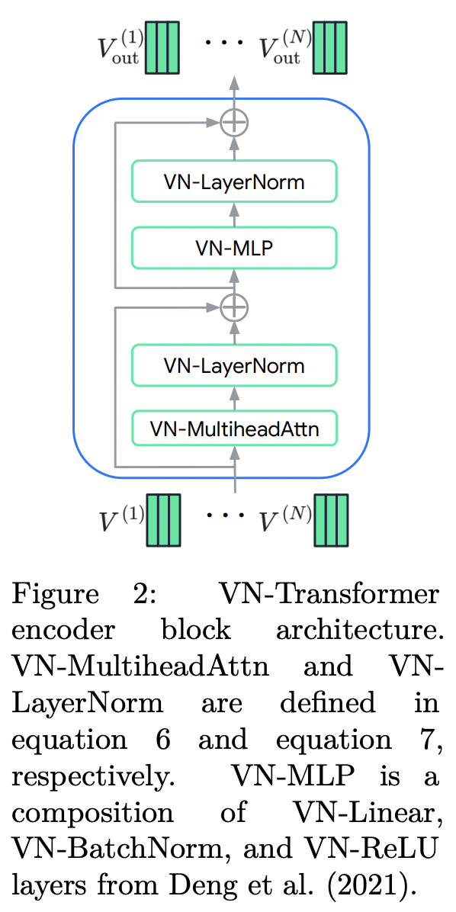

</img>

## VN (Vector Neuron) Transformer (wip)

A <a href="https://arxiv.org/abs/2206.04176">Transformer made of Rotation-equivariant Attention</a> using <a href="https://arxiv.org/abs/2104.12229">Vector Neurons</a>

<a href="https://openreview.net/forum?id=EiX2L4sDPG">Open Review</a>

## Install

```bash
$ pip install VN-transformer
```

## Usage

```python
import torch
from VN_transformer import VNTransformer

model = VNTransformer(
    dim = 64,
    depth = 2,
    dim_head = 64,
    heads = 8,
    beta_epsilon = 1e-6  # in this paper, they propose breaking equivariance with a tiny bit of bias noise in the VN linear. they claim this leads to improved stability. setting this to 0 would turn off the epsilon approximate equivariance
)

feats = torch.randn(1, 32, 64)
coors = torch.randn(1, 32, 3)    # (batch, sequence, spatial coordinates)

feats, coors = model(feats, coors)
```

## Tests

Confidence in equivariance

```bash
$ python setup.py test
```

## Todo

- [ ] complete the perceiver like feature aggregation
- [ ] offer both early and late fusion within `VNTransformer`
- [ ] see if it is straightforward to make translation in/equivariant
    - [ ] test on protein backbone denoising if above could be done

## Citations

```bibtex
@inproceedings{Assaad2022VNTransformerRA,
    title   = {VN-Transformer: Rotation-Equivariant Attention for Vector Neurons},
    author  = {Serge Assaad and C. Downey and Rami Al-Rfou and Nigamaa Nayakanti and Benjamin Sapp},
    year    = {2022}
}
```

```bibtex
@article{Deng2021VectorNA,
    title   = {Vector Neurons: A General Framework for SO(3)-Equivariant Networks},
    author  = {Congyue Deng and Or Litany and Yueqi Duan and Adrien Poulenard and Andrea Tagliasacchi and Leonidas J. Guibas},
    journal = {2021 IEEE/CVF International Conference on Computer Vision (ICCV)},
    year    = {2021},
    pages   = {12180-12189},
    url     = {https://api.semanticscholar.org/CorpusID:233394028}
}
```
